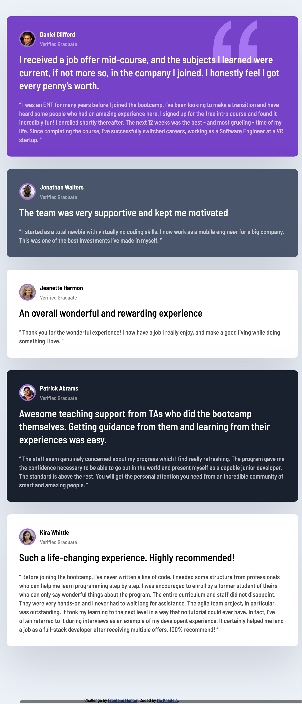
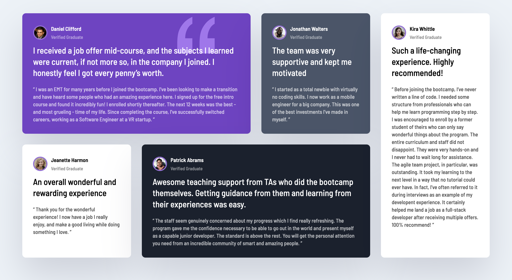

<h1 align="center">{ 💬 Testimonials Grid 💻 Desktop & Mobile 📱 }</h1>

<div align="center">
  <h3>
    <a href="https://mo-khaife-bot.github.io/Testimonials-Grid-Responsive/">
      Demo
    </a>
    <span> | </span>
    <a href="https://github.com/mo-khaife-bot/Testimonials-Grid-Responsive">
      Solution
    </a>
    <span> | </span>
    <a href="https://www.frontendmentor.io/challenges/testimonials-grid-section-Nnw6J7Un7">
      Challenge
    </a>
  </h3>
</div>

<br>

## Table of contents

- [Overview](#overview)
- [Built with](#built-with)
- [Live Demo](#live-demo)
- [What I learned](#what-i-learned)
- [Future Features](#Future-Features)
- [Author](#author)

<br>

## Overview

The goal is to build out this testimonials grid section and get it looking as close to the Figma design as possible, and make it responsive with an emphasis on mobile first.

| Mobile View                                     | Desktop View                                      |
| ----------------------------------------------- | ------------------------------------------------- |
|  |  |

## Built with

- Semantic HTML5 markup
- CSS custom properties
- Flexbox
- CSS Grid
- Mobile-first workflow via Media Queries

<br>

## Live Demo

[Live- Demo](https://mo-khaife-bot.github.io/Testimonials-Grid-Responsive/)

<br>
## What I learned

How to utilise CSS Grid to make the layout.

```css
.wrapper {
  display: grid;
  gap: 30px;

  grid-template-areas:
    "daniel daniel jonathan kira"
    "jeanette patrick patrick kira";
  grid-template-columns: repeat(4, 1fr);
}
```

<br>

## Future Features

- include a dark / light button to change theme of the page and make the bright colours dark and visa versa using just JS

<br>

## Author

- Website - [mo-khaife](https://mo-khaife-site.netlify.app/)
- Frontend Mentor - [@mo-khaife-bot](https://www.frontendmentor.io/profile/mo-khaife-bot)
